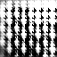
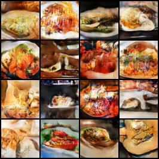

# DCGAN Assignment

This repository contains the implementation of two Deep Convolutional Generative Adversarial Networks (DCGAN) for image generation, developed as part of our assignment using the Yelp Dataset. Each model was built and trained independently by team members:

- **Model 1**: Developed by Aman Singh
- **Model 2**: Developed by Ramandeep Singh

---

## Overview of DCGAN

DCGAN is a generative adversarial network (GAN) architecture that consists of:

1. **Generator**: Produces realistic images from random noise.
2. **Discriminator**: Differentiates between real images and those generated by the generator.

The models were trained on the Yelp dataset to generate realistic images based on the distribution of the training data.

---

## Table of Contents

1. [Model 1: Aman Singh's DCGAN](#model-1-aman-singhs-dcgan)
2. [Model 2: Ramandeep Singh's DCGAN](#model-2-ramandeep-singhs-dcgan)
3. [Generated Images](#generated-images)

---

## Model 1: Aman Singh's DCGAN

### Step 1: Data Preprocessing and Preparation

- **Image Size**: Resized to 32x32.
- **Training Data**: 5,000 images.
- **Normalization**: Pixel values normalized to the range [-1, 1].
- **Batch Size**: 32.

### Step 2: Model Architecture

- **Generator**: Utilized `Dense`, `BatchNormalization`, `ReLU`, and `Conv2DTranspose` layers to generate 32x32 images from random noise.
- **Discriminator**: Used `Conv2D`, `LeakyReLU`, and `Flatten` layers to classify real vs fake images.

### Step 3: Training

- **Training Duration**: 30 epochs.
- **Optimizer**: Adam optimizers for both generator and discriminator.
- **Loss Function**:
  - Binary Cross-Entropy for both Generator and Discriminator.
- **Framework**: TensorFlow.

### Step 4: Results

- **Evaluation**: Achieved satisfactory performance based on Inception Score and FID.
- **Training Environment**: CPU-based training.

### Generated Images

Below is an example of a generated image from Model 1:

---

## Model 2: Ramandeep Singh's DCGAN

### Step 1: Data Preprocessing and Preparation

- **Image Size**: Resized to 64x64.
- **Training Data**: 100,000 images.
- **Normalization**: Pixel values normalized to the range [-1, 1].
- **Batch Size**: 64.

### Step 2: Model Architecture

- **Generator**: Designed to upscale random noise to 64x64 images using `Dense`, `BatchNorm`, `ReLU`, and `Conv2DTranspose`.
- **Discriminator**: Utilized `Conv2D`, `LeakyReLU`, and `Flatten` to classify real vs fake images.

### Step 3: Training

- **Training Duration**: 10 epochs.
- **Optimizer**: Adam optimizers for both generator and discriminator.
- **Loss Function**:
  - Binary Cross-Entropy for both Generator and Discriminator.
- **Framework**: PyTorch with CUDA and cuDNN libraries for GPU acceleration.

### Step 4: Results

- **Evaluation**: Demonstrated improved performance due to larger dataset and GPU-based training.
- **Training Environment**: NVIDIA GPU with CUDA.

### Generated Images

Below is an example of a generated image from Model 2:

---

## Generated Images

We saved 5 representative images generated by each model. These images can be found in the **`generated_images/`** directory.

---
